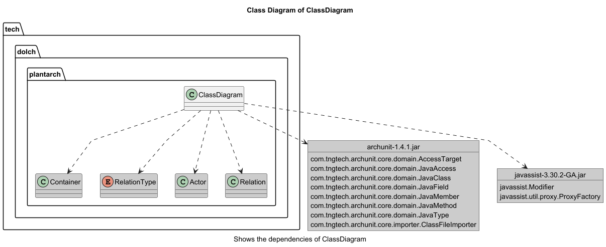
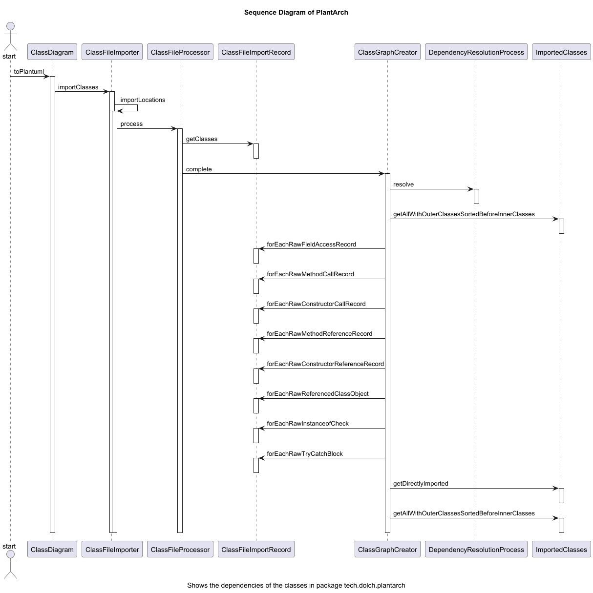
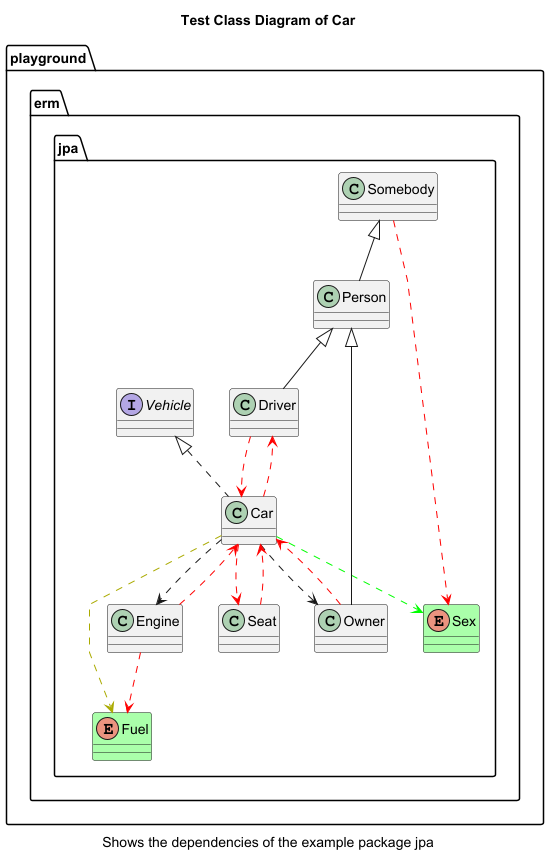

# PlantArch

[![mvn verify][ci_img]][ci_link]
[![Maven Central][maven_img]][maven_link]


**PlantArch** is a lightweight and easily configurable tool to generate architecture diagrams from Java classes —
inspired by [PlantUML](https://plantuml.com/) and software architecture principles.

## ✨ Features

- Parses Java classes and packages
- Supports **Class Diagrams**, **Entity-Relationship Models (ERMs)**, and **Sequence Diagrams**
- Automatically generates PlantUML-compatible output
- Easily configurable for different project structures
- Helps document and visualize software architecture

## 📦 Installation

Add the following dependency to your `pom.xml`:

```xml

<dependency>
    <groupId>io.github.mrdolch</groupId>
    <artifactId>plantarch</artifactId>
    <version>0.1.1</version>
</dependency>
```

Requires Java 8 or higher

## ⚙️ Diagram Types

- Class Diagram – shows classes and their relationships (inheritance, dependencies, etc.)
- ERM (Entity-Relationship Model) – useful for database schema visualization
- Sequence Diagram – illustrates object interactions over time

## 🚀 Usage

You can find a usage example in the test suite:
👉 [ClassDiagramTest.kt](src/test/kotlin/tech/dolch/plantarch/ClassDiagramTest.kt)

## Examples:

The class diagram shows the dependencies of the ClassDiagram class.
Source 👉 [ClassDiagramTest.kt](src/test/kotlin/tech/dolch/plantarch/ClassDiagramTest.kt)



This diagram shows a sequence diagram that was recorded using a JUnit test.
Source 👉 [SequenceDiagramTest.kt](src/test/kotlin/tech/dolch/plantarch/SequenceDiagramTest.kt)



This is a sample ERM diagram showing the relationships between classes and their members.
Source 👉 [ErmDiagramTest.kt](src/test/kotlin/tech/dolch/plantarch/ErmDiagramTest.kt)


This is a sample class diagram showing the dependencies between individual classes. The arrows are color-coded based on
the type of dependency.
Source 👉 [ClassDiagramTest.kt](src/test/kotlin/tech/dolch/plantarch/ClassDiagramTest.kt)



## 🤝 Contributing

Contributions are welcome! If you'd like to improve PlantArch, feel free to open a pull request or start a discussion
via issues.

[ci_img]: https://github.com/mrdolch/plantarch/actions/workflows/maven-verify.yml/badge.svg

[ci_link]: https://github.com/mrdolch/plantarch/actions/maven-verify.yml

[maven_img]: https://maven-badges.herokuapp.com/maven-central/io.github.mrdolch/plantarch/badge.svg

[maven_link]: https://maven-badges.herokuapp.com/maven-central/io.github.mrdolch/plantarch